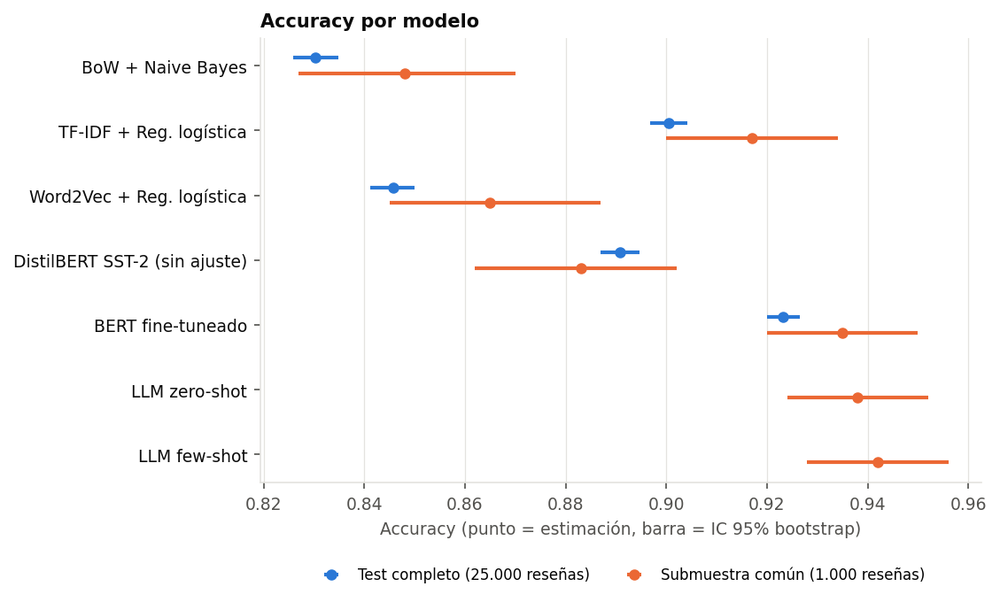
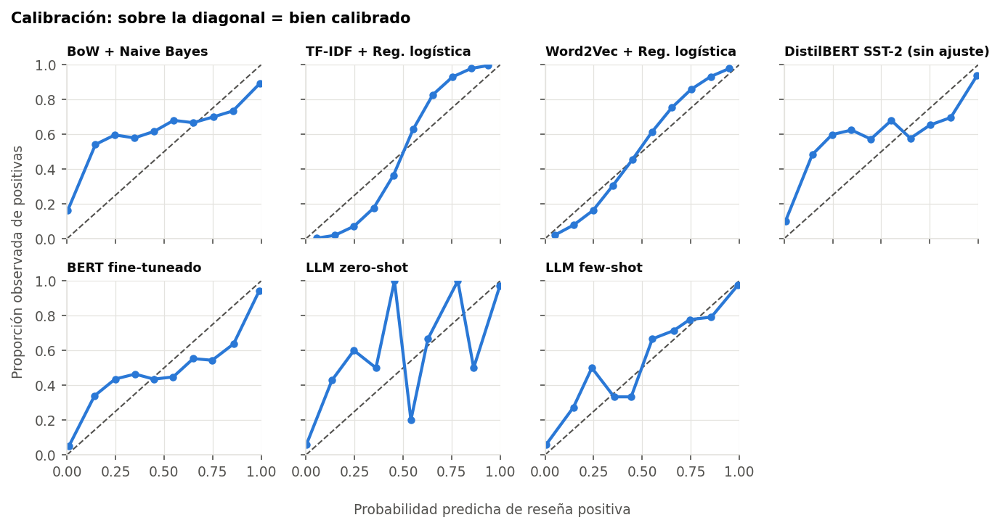
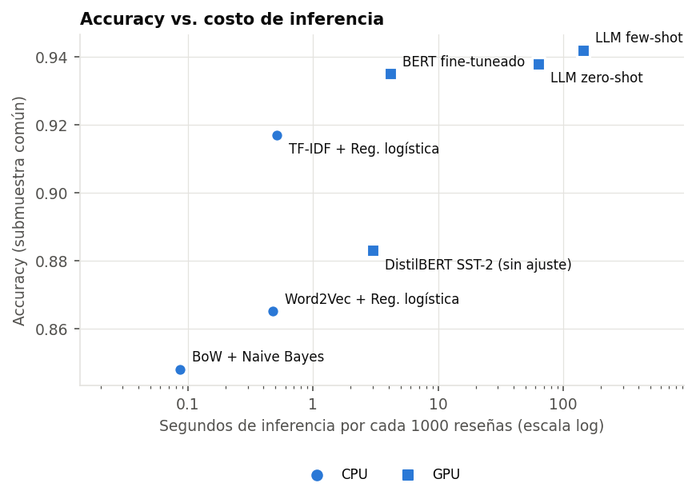
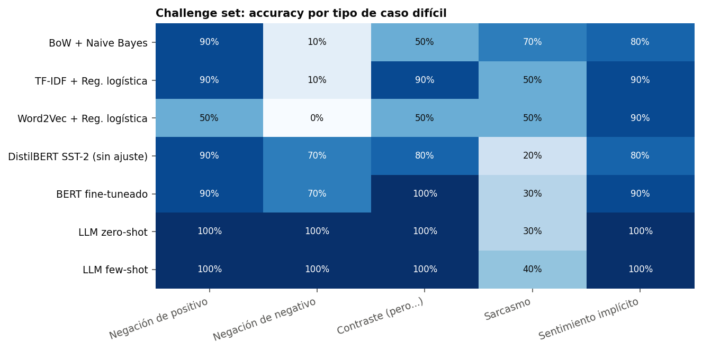

# De Bag of Words a LLMs: análisis de sentimiento en IMDB

¿Cuánto se gana realmente con cada salto en la historia del procesamiento del lenguaje natural, y a qué costo?

Este proyecto resuelve **una misma tarea** (clasificar reseñas de películas como positivas o negativas) con siete modelos que recorren esa historia: desde contar palabras hasta un LLM sin entrenamiento. Todos se evalúan **sobre las mismas reseñas**, con intervalos de confianza, tests pareados, calibración y un conjunto de casos difíciles escrito a mano.

**Datos:** [IMDB Large Movie Review Dataset](https://huggingface.co/datasets/stanfordnlp/imdb) (Maas et al., 2011). 25.000 reseñas para entrenar, 25.000 para evaluar, clases balanceadas, y 50.000 reseñas adicionales sin etiqueta.

**Stack:** Python · scikit-learn · NLTK · gensim · PyTorch · Hugging Face Transformers

\---

## Las etapas

|#|Modelo|Representación del texto|Qué muestra|
|-|-|-|-|
|1|BoW + Naive Bayes|Conteo de palabras|El baseline, y cuánto importa el preprocesamiento|
|2|TF-IDF + regresión logística|Términos ponderados, con bigramas|Qué tan lejos llega un modelo lineal bien armado|
|3|Word2Vec + regresión logística|Promedio de vectores densos|La semántica ayuda, pero promediar pierde el orden y la negación|
|4a|DistilBERT SST-2, sin ajuste|Embeddings contextuales|Cuánto se transfiere un clasificador entrenado en otro dataset|
|4b|BERT fine-tuneado|Embeddings contextuales|El salto que da el contexto cuando se entrena sobre la tarea|
|5|LLM zero-shot y few-shot|Prompt a un LLM instruccional|Clasificar sin entrenar nada, con otro perfil de costo|

## Cómo se evalúa

La mayoría de las comparaciones de este tipo terminan en una tabla de accuracy. Acá se agregan cinco cosas:

* **Submuestra común.** El LLM se evalúa sobre 1.000 reseñas por costo. Para compararlo de forma justa, *todos* los modelos se evalúan también sobre esas mismas 1.000 reseñas (fijadas con semilla en [`data/submuestra\_idx.csv`](data/submuestra_idx.csv)).
* **Intervalos de confianza por bootstrap.** Con 1.000 reseñas y una accuracy cerca de 0.9, el intervalo del 95% mide unos ±2 puntos: muchas diferencias que parecen claras no lo son.
* **Test de McNemar.** Como todos los modelos clasifican las mismas reseñas, la comparación correcta es pareada: solo cuentan los casos donde un modelo acierta y el otro no.
* **Calibración.** Además de acertar, ¿las probabilidades significan algo? Si un modelo dice 90%, debería acertar el 90% de esas veces. Se mide con el ECE (*Expected Calibration Error*) y diagramas de confiabilidad.
* **Challenge set.** [50 reseñas escritas a mano](data/challenge_set.csv) en cinco categorías difíciles: negación de algo positivo (*"not good at all"*), negación de algo negativo (*"not bad at all"*), contraste (*"…but…"*), sarcasmo y sentimiento implícito sin palabras de opinión (*"I walked out after forty minutes"*). Con 10 casos por categoría sirve para ver patrones, no para sacar conclusiones estadísticas.

Además se registra el **costo**: tiempo de entrenamiento y de inferencia, y en qué hardware corrió cada modelo.

## Resultados

<!-- RESULTADOS:INICIO -->
*Sección generada automáticamente por `python -m src.analizar`.*

### Test completo (25.000 reseñas)

| Modelo | Accuracy [IC 95%] | F1 | ECE | Inferencia (s / 1000 reseñas) | Entrenamiento (s) | Hardware |
|---|---|---|---|---|---|---|
| BoW + Naive Bayes | 0.8303 [0.8258, 0.8349] | 0.8206 | 0.138 | 0.09 | 2 | CPU |
| TF-IDF + Reg. logística | 0.9004 [0.8968, 0.9042] | 0.9009 | 0.122 | 0.51 | 20 | CPU |
| Word2Vec + Reg. logística | 0.8458 [0.8412, 0.8499] | 0.8440 | 0.058 | 0.48 | 431 | CPU |
| DistilBERT SST-2 (sin ajuste) | 0.8908 [0.8870, 0.8947] | 0.8876 | 0.084 | 3.01 | 0 | GPU (Tesla T4) |
| BERT fine-tuneado | 0.9232 [0.9200, 0.9266] | 0.9236 | 0.051 | 4.16 | 787 | GPU (Tesla T4) |

### Submuestra común (1.000 reseñas, todos los modelos)

El LLM se evalúa solo sobre esta submuestra por costo. Para compararlo en igualdad de condiciones, todos los modelos se evalúan también sobre las mismas 1.000 reseñas.

| Modelo | Accuracy [IC 95%] | F1 | ECE |
|---|---|---|---|
| BoW + Naive Bayes | 0.8480 [0.8270, 0.8700] | 0.8390 | 0.123 |
| TF-IDF + Reg. logística | 0.9170 [0.9000, 0.9340] | 0.9177 | 0.135 |
| Word2Vec + Reg. logística | 0.8650 [0.8450, 0.8870] | 0.8629 | 0.081 |
| DistilBERT SST-2 (sin ajuste) | 0.8830 [0.8620, 0.9020] | 0.8802 | 0.092 |
| BERT fine-tuneado | 0.9350 [0.9200, 0.9500] | 0.9355 | 0.042 |
| LLM zero-shot | 0.9380 [0.9240, 0.9520] | 0.9375 | 0.052 |
| LLM few-shot | 0.9420 [0.9280, 0.9560] | 0.9415 | 0.042 |



### ¿Las diferencias son significativas? (test de McNemar)

Como todos los modelos se evalúan sobre las mismas reseñas, la comparación correcta es pareada: solo importan los casos en los que un modelo acierta y el otro no.

| Comparación | Conjunto | Solo acierta el 1º | Solo acierta el 2º | p-valor |
|---|---|---|---|---|
| BoW + Naive Bayes vs. TF-IDF + Reg. logística | Test completo | 785 | 2538 | < 1e-16 |
| TF-IDF + Reg. logística vs. Word2Vec + Reg. logística | Test completo | 2066 | 699 | < 1e-16 |
| Word2Vec + Reg. logística vs. DistilBERT SST-2 (sin ajuste) | Test completo | 1524 | 2650 | < 1e-16 |
| DistilBERT SST-2 (sin ajuste) vs. BERT fine-tuneado | Test completo | 871 | 1682 | < 1e-16 |
| TF-IDF + Reg. logística vs. LLM zero-shot | Submuestra | 35 | 56 | 0.036 |
| BERT fine-tuneado vs. LLM zero-shot | Submuestra | 30 | 33 | 0.8 |
| TF-IDF + Reg. logística vs. LLM few-shot | Submuestra | 31 | 56 | 0.01 |
| BERT fine-tuneado vs. LLM few-shot | Submuestra | 26 | 33 | 0.43 |
| LLM zero-shot vs. LLM few-shot | Submuestra | 7 | 11 | 0.48 |

### Calibración

¿Cuando un modelo dice 90%, acierta el 90% de las veces? El ECE (Expected Calibration Error) resume la distancia a la diagonal: más bajo es mejor.



### Costo



### Challenge set (50 reseñas escritas a mano)

| Modelo | Negación de positivo | Negación de negativo | Contraste (pero...) | Sarcasmo | Sentimiento implícito | Total |
|---|---|---|---|---|---|---|
| BoW + Naive Bayes | 90% | 10% | 50% | 70% | 80% | 60% |
| TF-IDF + Reg. logística | 90% | 10% | 90% | 50% | 90% | 66% |
| Word2Vec + Reg. logística | 50% | 0% | 50% | 50% | 90% | 48% |
| DistilBERT SST-2 (sin ajuste) | 90% | 70% | 80% | 20% | 80% | 68% |
| BERT fine-tuneado | 90% | 70% | 100% | 30% | 90% | 76% |
| LLM zero-shot | 100% | 100% | 100% | 30% | 100% | 86% |
| LLM few-shot | 100% | 100% | 100% | 40% | 100% | 88% |



### Etapa 1 en detalle: efecto del preprocesamiento en BoW + Naive Bayes

| Preprocesamiento | Vocabulario | Accuracy CV (train) | Accuracy test |
|---|---|---|---|
| Solo limpieza | 44.200 | 0.8462 ± 0.0031 | 0.8140 |
| Sin stopwords (lista NLTK completa) | 44.064 | 0.8606 ± 0.0037 | 0.8253 |
| Sin stopwords, conservando negaciones | 44.067 | 0.8600 ± 0.0035 | 0.8255 |
| + Stemming | 29.172 | 0.8544 ± 0.0042 | 0.8167 |
| + Lematización con POS | 36.107 | 0.8548 ± 0.0021 | 0.8193 |
| + Marcado de negación | 55.290 | 0.8612 ± 0.0022 | 0.8303 |

<!-- RESULTADOS:FIN -->

## Decisiones de diseño

Algunas decisiones que no se ven en la tabla final pero cambian los resultados:

* **Las negaciones no son stopwords.** La lista de stopwords de NLTK incluye *not*, *no* y *nor*. Sacarlas convierte "not good" en "good", lo contrario de lo que se quiere en análisis de sentimiento. La etapa 1 compara ambas versiones.
* **Las contracciones se expanden antes de limpiar.** Si no, al borrar la puntuación "didn't" queda partido en "didn" + "t" y la negación se pierde.
* **El lematizador recibe la etiqueta gramatical.** Sin ella, `WordNetLemmatizer` trata todo como sustantivo: "running" no pasa a "run" ni "better" a "good".
* **El preprocesamiento se elige con validación cruzada sobre train.** Elegirlo mirando el test sería sobreajustar al test.
* **El LLM no genera texto: se leen sus probabilidades.** En vez de buscar "positive" en la respuesta (donde cualquier respuesta rara se cuenta como negativa), se compara la probabilidad que el modelo le asigna a *positive* y a *negative* como primera palabra. Así no hay respuestas imposibles de interpretar y se obtiene una probabilidad para medir calibración.
* **Los ejemplos few-shot están balanceados y son aleatorios.** El split de train viene ordenado por clase (primero los 12.500 negativos), así que tomar "los primeros 4" daría cuatro ejemplos negativos.
* **Se guardan las probabilidades de cada reseña, no solo las métricas.** Todo el análisis estadístico se hace después sobre esos archivos ([`results/predicciones/`](results/predicciones/)), sin volver a entrenar.

## Estructura del repo

```
nlp\_TPs/
├── notebooks/
│   └── experimentos.ipynb      # corre todo en Colab y actualiza este README
├── src/
│   ├── datos.py                # carga de IMDB, submuestra fija y challenge set
│   ├── preprocesamiento.py     # limpieza y variantes (stopwords, stemming, lematización, negación)
│   ├── modelos/
│   │   ├── clasicos.py         # etapas 1 a 3
│   │   ├── transformers\_gpu.py # etapas 4a y 4b
│   │   └── llm.py              # etapa 5
│   ├── evaluacion.py           # bootstrap, McNemar, ECE, curva de confiabilidad
│   ├── analizar.py             # tablas, gráficos y sección de resultados del README
│   └── correr.py               # corre las etapas desde la terminal
├── data/
│   ├── challenge\_set.csv       # 50 reseñas "difíciles" escritas a mano
│   └── submuestra\_idx.csv      # índices de la submuestra común de 1.000 reseñas
├── results/                    # predicciones, tiempos, tablas y figuras
└── tests/                      # prueba de punta a punta con datos sintéticos
```

## Cómo reproducirlo

**En Colab (recomendado):** abrí [`notebooks/experimentos.ipynb`](notebooks/experimentos.ipynb) en Colab, elegí una GPU T4 y corré todas las celdas. 

**Localmente:**

```bash
pip install -r requirements.txt
python -m src.correr --etapas bow tfidf w2v   # modelos que corren en CPU
python -m src.correr --etapas sst2 bert llm   # requieren GPU para tiempos razonables
python -m src.analizar                        # tablas, gráficos y README
pytest                                        # prueba de punta a punta con datos sintéticos
```

## Limitaciones

* BERT ve como máximo 256 tokens por reseña; el resto se trunca. Algunas reseñas de IMDB son bastante más largas.
* Cada modelo se entrena con una sola semilla, así que los intervalos reflejan la variabilidad del test, no la del entrenamiento.
* El LLM es un modelo abierto chico (1.500 millones de parámetros) para que entre en una GPU gratuita. Un modelo más grande probablemente rinda más.
* El challenge set tiene 10 reseñas por categoría: muestra tendencias, no diferencias significativas.

